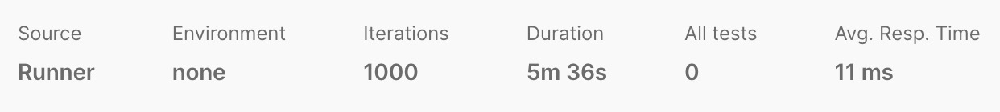

English | [中文](README_zh.md)

TikGok is a simplified version of Douyin based on Hertz and Kitex, which implements all interfaces as required and optimizes the business. In addition, the governance capabilities of the project have been improved, such as the introduction of technology stacks such as configuration centers, service centers, and OTEL.

## Quick Start

TODO

## Project Implementation

### Technology Selection

- HTTP frame using Hertz
- RPC framework using Kitex
- The relational database chooses MySQL
- Non-relational database chooses Redis
- Both the service center and the configuration center use Nacos
- The object storage service uses Minio
- The message queue uses RabbitMQ
- Use Jaeger and Prometheus for link tracking and monitoring
- CI using Github Actions

### Architecture Design

#### Call Relation


#### Technology Architecture

TODO

#### Service Relation

TODO

#### MySQL Design


##### Index Design

###### User

`username` set a unique index

###### Favorite

`user_id` and `video_id` set up a joint unique index

###### Video

`user_id` sets a normal index

###### Comment

`video_id` set normal index

##### Follow

`user_id` and `follower_id` set up a joint unique index

###### Message

Joint index for `to_user_id` and `from_user_id`

#### Redis Design

##### User

`User id` is used as key, and `User information` is used as value.

##### Video

`Video id` is used as key, and `Video information` is used as value.

The `user id` is used as the key of the ordered set, the `video id` posted by the user is the member, and the sorting score is the `published time`.

Separately maintain an ordered set whose key is `consts.AllVideoSortSetKey`, all the `video id` published by all users are members of the ordered set, and the sorting score is `published time`.

##### Interaction

- commentDB
    - `comment id` as key, `comment information` as value.

    - `Video id` is used as the key of the ordered set, the `comment id` of the video is member, and the sorting score is `video release time`.
- favoriteDB

The `user id` is used as the key of the ordered collection, the `video id` of its likes is the member, and the sorting score is the `like time`.

`Video Id` is used as the key of the ordered collection, the `user id` of its thumbs-up is the member, and the sorting score is the `like time`.

##### Sociality

`User id`` ``+`` ``consts.RedisFollowSuffix` is the key of the collection, the artificial collection element that the user follows

`User id`` ``+`` ``consts.RedisFollowerSuffix` is the key of the collection, and the user’s score is the collection element

#### Message Queue Design

All data entered into MySQL will be published to the message queue first, and each service will have its own subscriber coroutine to continuously obtain the contents of the message queue. This can avoid the impact on MySQL when the traffic is too large.

### Project Code Introduction

#### Project Code Structure

##### The Main Structure

```Bash
├── docker-compose.yaml
├── otel-collector-config.yaml
├── go.mod
├── go.sum
├── server
│ ├── cmd
│ │ ├── api
│ │ ├── chat
│ │ ├── interaction
│ │ ├── sociality
│ │ ├── user
│ │ └── video
│ ├── idl
│ │ ├── api. thrift
│ │ ├── base. thrift
│ │ ├── chat. thrift
│ │ ├── errno.thrift
│ │ ├── interaction. thrift
│ │ ├── sociality.thrift
│ │ ├── user.thrift
│ │ └── video. thrift
│ └── shared
│ ├── Makefile
│ ├── consts
│ ├── errno
│ ├── kitex_gen
│ ├── middleware
│ ├── test
│ └── tools
```

##### Microservice Internal Structure

> Take the user service as an example

```Bash
├── Makefile
├──config
│ └── config.go
├── config.yaml
├── dao
│ ├── user.go
│ └── user_test.go
├── global
│ └── global.go
├── handler.go
├── initialize
│ ├── chat_service.go
│ ├── db.go
│ ├── flag.go
│ ├── logger.go
│ ├── nacos.go
│ ├── redis.go
│ └── sociality_service.go
├──kitex.yaml
├── main.go
├── model
│ └── user.go
└── pkg
     ├── chat.go
     ├── md5.go
     ├── pack.go
     ├── redis.go
     ├── redis_test.go
     └── sociality.go
```

#### database

##### MySQL

###### Initialization

```Go
//InitDB to init database
func InitDB() {
    c := global.ServerConfig.MysqlInfo
    dsn := fmt.Sprintf(consts.MySqlDSN, c.User, c.Password, c.Host, c.Port, c.Name)
    newLogger := logger. New(
       logrus. NewWriter(), // io writer
       logger. Config{
          SlowThreshold: time. Second, // Slow SQL Threshold
          LogLevel: logger. Silent, // Log level
          Colorful: true, // Disable color printing
       },
    )

    // global mode
    var err error
    global.DB, err = gorm.Open(mysql.Open(dsn), &gorm.Config{
       NamingStrategy: schema. NamingStrategy{
          SingularTable: true,
       },
       Logger: newLogger,
    })
    if err != nil {
       klog.Fatalf("init gorm failed: %s", err)
    }
    if err := global.DB.Use(tracing.NewPlugin()); err != nil {
       klog.Fatalf("use tracing plugin failed: %s", err)
    }
}
```

MySQL uses GORM to operate, so we need to initialize MySQL through GORM. It is worth mentioning that the log here uses the Logrus log in the Opentelemetry plug-in provided by GORM, which will be introduced again later.

###### use

> Take user as an example

We first build the data model in the `model` layer under the microservice.

```Go
type User struct {
    ID int64 `gorm:"primarykey"`
    Username string `gorm:"type:varchar(33);unique;not null"`
    Password string `gorm:"type:varchar(33);not null"`
    Avatar string `gorm:"type:varchar;not null"`
    BackGroundImage string `gorm:"type:varchar;not null"`
    Signature string `gorm:"type:varchar;not null"`
}
```

Then add, delete, modify and check is implemented in the `dao` layer under the microservice, taking creating a user as an example.

```Go
// CreateUser creates a user.
func (u *User) CreateUser(user *model. User) error {
    err := u.db.Model(&model.User{}).
       Where(&model.User{Username: user.Username}).First(&model.User{}).Error
    if err == nil {
       return ErrUserExist
    } else if err != gorm. ErrRecordNotFound {
       return err
    }
    return u.db.Model(&model.User{}).Create(user).Error
}
```

##### Redis

###### Initialization

```Go
func InitRedis() {
    global.RedisClient = redis.NewClient(&redis.Options{
       Addr: fmt.Sprintf("%s:%d", global.ServerConfig.RedisInfo.Host, global.ServerConfig.RedisInfo.Port),
       Password: global.ServerConfig.RedisInfo.Password,
       DB: consts. RedisSocialClientDB,
    })
}
```

If multiple clients are required, they can be customized as required during initialization.

###### use

When we need Redis to complete which services, we can first define them in `handler.go`, here we take user as an example.

```Go
// RedisManager defines the redis interface.
type RedisManager interface {
    GetUserById(ctx context.Context, uid int64) (*model.User, error)
    BatchGetUserById(ctx context.Context, uidList []int64) ([]*model.User, error)
    CreateUser(ctx context.Context, user *model.User) error
}
```

Then we can implement these interfaces in the `pkg` layer under the microservice. Here we take creating users as an example.

```Go
// CreateUser creates a user.
func (r *RedisManager) CreateUser(ctx context.Context, user *model.User) error {
    uidStr := fmt.Sprintf("%d", user.ID)
    exists, err := r.redisClient.HExists(ctx, uidStr, consts.UsernameFiled).Result()
    if err != nil {
       return err
    }
    if exists {
       return errno.UserServerErr.WithMessage("user already exists")
    }
    batchData := make(map[string]string)
    batchData[consts.UsernameFiled] = user.Username
    batchData[consts.CryptPwdFiled] = user.Password
    return r.redisClient.HMSet(ctx, uidStr, batchData).Err()
}
```

##### Minio

###### Initialization

```Go
func initMinio() {
    mi := global.ServerConfig.UploadServiceInfo.MinioInfo
    // Initialize minio client object.
    mc, err := minio.New(mi.Endpoint, &minio.Options{
       Creds: credentials.NewStaticV4(mi.AccessKeyID, mi.SecretAccessKey, ""),
       Secure: false,
    })
    if err != nil {
       klog.Fatalf("create minio client err: %s", err.Error())
    }
    exists, err := mc.BucketExists(context.Background(), mi.Bucket)
    if err != nil {
       klog. Fatal(err)
    }
    if !exists {
       err = mc.MakeBucket(context.Background(), mi.Bucket, minio.MakeBucketOptions{Region: "cn-north-1"})
       if err != nil {
          klog.Fatalf("make bucket err: %s", err.Error())
       }
    }
    policy := `{"Version": "2012-10-17","Statement": [{"Action": ["s3:GetObject"],"Effect": "Allow","Principal": {"AWS ": ["*"]},"Resource": ["arn:aws:s3:::` + mi.Bucket + `/*"],"Sid": ""}]}`
    err = mc.SetBucketPolicy(context.Background(), mi.Bucket, policy)
    if err != nil {
       klog.Fatal("set bucket policy err:%s", err)
    }
    minioClient = mc
}
```

###### use

Combining message queues to realize asynchronous upload of videos and covers

```Go
func (s *Service) RunVideoUpload() error {
    taskCh, cleanUp, err := s.subscriber.Subscribe(context.Background())
    defer cleanUp()
    if err != nil {
       klog. Error("cannot subscribe", err)
       return err
    }
    for task := range taskCh {
       if err = getVideoCover(task.VideoTmpPath, task.CoverTmpPath); err != nil {
          klog.Errorf("get video cover err: videoTmpPath = %s", task.VideoTmpPath)
          continue
       }
       suffix, err := getFileSuffix(task.VideoTmpPath)
       if err != nil {
          klog.Errorf("get video suffix err:videoTmpPath = %s", task.VideoTmpPath)
          continue
       }
       buckName := s.config.MinioInfo.Bucket

       if _, err = s.minioClient.FPutObject(context.Background(), buckName, task.CoverUploadPath, task.CoverTmpPath, minio.PutObjectOptions{
          ContentType: "image/png",
       }); err != nil {
          klog.Error("upload cover image err", err)
          continue
       }
       _ = os. Remove(task. CoverTmpPath)
       if _, err = s.minioClient.FPutObject(context.Background(), buckName, task.VideoUploadPath, task.VideoTmpPath, minio.PutObjectOptions{
          ContentType: fmt.Sprintf("video/%s", suffix),
       }); err != nil {
          klog.Error("upload video err", err)
          continue
       }
       _ = os. Remove(task. VideoTmpPath)
    }
    return nil
}
```

#### Middleware

##### RabbitMQ

###### Initialization

```Go
// InitMq to init rabbitMQ
func InitMq() {
    c := global.ServerConfig.RabbitMqInfo
    amqpConn, err := amqp.Dial(fmt.Sprintf(consts.RabbitMqURI, c.User, c.Password, c.Host, c.Port))
    if err != nil {
       klog.Fatal("cannot dial amqp", err)
    }
    global.AmqpConn = amqpConn
}
```

###### use

Define the Publish interface in `handler.go` for use.

```Go
// Publisher defines the publisher interface.
type Publisher interface {
    Publish(context.Context, *sociality.DouyinRelationActionRequest) error
}
```

Implemented in `amqp.go` in `pkg`

```Go
// Publish publishes a message.
func (p *Publisher) Publish(_ context.Context, car *sociality.DouyinRelationActionRequest) error {
    body, err := sonic. Marshal(car)
    if err != nil {
       return fmt.Errorf("cannot marshal: %v", err)
    }

    return p.ch.Publish(p.exchange, "", false, false, amqp.Publishing{
       Body: body,
    })
}
```

In `main.go`, a coroutine will be opened to consume messages, and the logic of consumption needs to be defined by yourself. Here we take sociality as an example.

```Go
func SubscribeRoutine(subscriber *Subscriber, dao *dao.Follow) {
   msgs, cleanUp, err := subscriber.Subscribe(context.Background())
   defer cleanUp()
   if err != nil {
      klog.Error("cannot subscribe", err)
   }
   for m := range msgs {
      fr, err := dao.FindRecord(m.ToUserId, m.UserId)
      if err == nil && fr == nil {
         err = dao.CreateFollow(&model.Follow{
            UserId:     m.ToUserId,
            FollowerId: m.UserId,
            ActionType: m.ActionType,
         })
         if err != nil {
            klog.Error("follow action error", err)
         }
      }
      if err != nil {
         klog.Error("follow error", err)
      }
      err = dao.UpdateFollow(m.ToUserId, m.UserId, m.ActionType)
      if err != nil {
         klog.Error("follow error", err)
      }
   }
}
```

##### Logger

```Go
// InitLogger to init logrus
func InitLogger() {
   // Customizable output directory.
   logFilePath := consts.KlogFilePath
   if err := os.MkdirAll(logFilePath, 0o777); err != nil {
      panic(err)
   }

   // Set filename to date
   logFileName := time.Now().Format("2006-01-02") + ".log"
   fileName := path.Join(logFilePath, logFileName)
   if _, err := os.Stat(fileName); err != nil {
      if _, err := os.Create(fileName); err != nil {
         panic(err)
      }
   }

   logger := kitexlogrus.NewLogger()
   // Provides compression and deletion
   lumberjackLogger := &lumberjack.Logger{
      Filename:   fileName,
      MaxSize:    20,   // A file can be up to 20M.
      MaxBackups: 5,    // Save up to 5 files at the same time.
      MaxAge:     10,   // A file can exist for a maximum of 10 days.
      Compress:   true, // Compress with gzip.
   }

   if runtime.GOOS == "linux" {
      logger.SetOutput(lumberjackLogger)
   }
   logger.SetLevel(klog.LevelDebug)

   klog.SetLogger(logger)
}
```

Logging uses the Logrus logging library in the Hertz/Kitex Opentelemetry extension. When the system is Linux, which is the online environment, the output of the log will be redirected, and the log will be compressed and periodically deleted using the Lumberjack library. When developing the environment, it will be printed directly on the console, which is convenient for debugging.

##### Gzip

```Go
gzip.Gzip(gzip.DefaultCompression, gzip.WithExcludedExtensions([]string{".jpg", ".mp4", ".png"})),
```

Use the Gzip middleware resource to compress, and customize the resource format that does not compress.

##### Pprof

Test the project with the Pprof middleware.

```Go
pprof.Register(h)
```

TikGok is a minimal version of TikTok based on Hertz and Kitex.

```Bash
go tool pprof -http=:8001 http://127.0.0.1:8080/debug/pprof/profile
```


It can be seen that the optimized flame graph has better performance and shorter service call time.

#### Service Governance

##### Nacos

Nacos will take on the functions of service center and configuration center at the same time to save online resources.

###### Initialization

```Go
// InitNacos to init nacos
func InitNacos(Port int) (registry.Registry, *registry.Info) {
   v := viper.New()
   v.SetConfigFile(consts.UserConfigPath)
   // ...

   configClient, err := clients.CreateConfigClient(map[string]interface{}{
      "serverConfigs": sc,
      "clientConfig":  cc,
   })
   // ...
   content, err := configClient.GetConfig(vo.ConfigParam{
      DataId: global.NacosConfig.DataId,
      Group:  global.NacosConfig.Group,
   })
   // ...
   err = sonic.Unmarshal([]byte(content), &global.ServerConfig)
   if err != nil {
      klog.Fatalf("nacos config failed: %s", err)
   }
   // ...
   registryClient, err := clients.NewNamingClient(
      vo.NacosClientParam{
         ClientConfig:  &cc,
         ServerConfigs: sc,
      },
   )
   // ...

   r := nacos.NewNacosRegistry(registryClient, nacos.WithGroup(consts.UserGroup))

   // ...
   return r, info
}
```

Due to the length of the code, only the key code is provided here. We first configure Nacos through Viper, initialize the configuration center, and then initialize the service center and register the service.

Kitex and Hertz do automatic service deregistration on graceful deferral. For service discovery, please pay attention to the RPC section below.

##### Opentelemetry

What OpenTelemetry needs to solve is the unification of observability. In our project, Trace uses Jaeger, Metrics uses Prometheus, and Logs uses Logrus (the same log library configured in GORM logs).

```Go
p := provider.NewOpenTelemetryProvider(
   provider.WithServiceName(global.ServerConfig.Name),
   provider.WithExportEndpoint(global.ServerConfig.OtelInfo.EndPoint),
   provider.WithInsecure(),
)
defer p.Shutdown(context.Background())
```

#### Secure

##### ErrNo

Use ErrNo in the project to provide more error information but not return the error information inside the system to the front end. The error codes are defined in IDL.

```Thrift
namespace go errno

enum Err {
    Success              = 0,
    ParamsErr            = 1,
    ServiceErr           = 2,
    RPCInteractionErr    = 10000,
    InteractionServerErr = 10001,
    RPCSocialityErr      = 20000,
    SocialityServerErr   = 20001,
    RPCUserErr           = 30000,
    UserServerErr        = 30001,
    UserAlreadyExistErr  = 30002,
    UserNotFoundErr      = 30003,
    AuthorizeFailErr     = 30004,
    RPCVideoErr          = 40000,
    VideoServerErr       = 40001,
    RPCChatErr           = 50000,
    ChatServerErr        = 50001,
}
```

At the same time, the error message is also defined in `shared/errno`, here we take `Success` as an example.

```Go
Success = NewErrNo(int64(errno.Err_Success), "success")
```

In addition, you can also customize the error message, take the `SentMessage` method as an example.

```Go
func (s *ChatServiceImpl) SentMessage(ctx context.Context, req *chat.DouyinMessageActionRequest) (resp *chat.DouyinMessageActionResponse, err error) {
     //...
     if err != nil {
         klog.Error("publish message error", err)
         resp.BaseResp = tools.BuildBaseResp(errno.ChatServerErr.WithMessage("sent message error"))
         return resp, nil
     }
     //...
}
```

##### JWT

The secret key is obtained from the configuration center and does not appear in the code, which realizes desensitization. When the user successfully logs in or registers successfully, a Token is generated, and some information of the user is added to the Token.

```Go
resp.UserId = usr.ID
resp.Token, err = s.Jwt.CreateToken(models.CustomClaims{
    ID: usr.ID,
    StandardClaims: jwt. StandardClaims{
       NotBefore: time.Now().Unix(),
       ExpiresAt: time.Now().Unix() + consts.ThirtyDays,
       Issuer: consts. JWTI Issuer,
    },
})
```

In the gateway layer, we will use the JWTAuth middleware to verify the incoming Token.

```Go
func _publishMw() [] app.HandlerFunc {
    return []app.HandlerFunc{
       middleware.JWTAuth(global.ServerConfig.JWTInfo.SigningKey),
    }
}
```

##### MD5

When we register a user, the password will not be stored in plain text, and the password will be encrypted with MD5 and salt first.

```Go
// Md5Crypt uses MD5 encryption algorithm to add salt encryption.
func Md5Crypt(str string, salt...interface{}) (CryptStr string) {
    if l := len(salt); l > 0 {
       slice := make([]string, l+1)
       str = fmt.Sprintf(str+strings.Join(slice, "%v"), salt...)
    }
    return fmt.Sprintf("%x", md5.Sum([]byte(str)))
}
```

It is used during the registration phase.

```Go
// Register implements the UserServiceImpl interface.
func (s *UserServiceImpl) Register(ctx context.Context, req *user.DouyinUserRegisterRequest) (resp *user.DouyinUserRegisterResponse, err error) {
    //...
    usr := &model. User{
       ID: sf.Generate().Int64(),
       Username: req. Username,
       Password: pkg.Md5Crypt(req.Password, global.ServerConfig.MysqlInfo.Salt), // Encrypt password with md5.
    }
    //...
}
```

During the subsequent login, the password entered by the user will be encrypted again, and the encrypted data will be compared with the data in the database. If they are the same, the password is correct, otherwise the password is wrong.

##### Limiter

Use the Limiter middleware to limit the current of the project

```Go
limiter.AdaptiveLimit(limiter.WithCPUThreshold(900)),
```

- When the CPU load is less than 90%: the current time is less than 1 second from the last triggering of the current limit, then judge whether the current maximum number of requests is greater than the maximum load in the past, and if it is greater than the load, then limit the flow.
- When the CPU load is greater than 90%: Determine whether the current number of requests is greater than the maximum load in the past, and if it is greater than the maximum load in the past, limit the current.

#### other

#####RPC

When a microservice needs to call other microservices, it needs to make RPC calls. In `pkg`, we initialize the required services. Here, the user service needs to call the chat service as an example.

###### Initialization

```Go
// InitChat init chat service.
func InitChat() {
    // init resolver
    // Read configuration information from nacos
    sc := []constant. ServerConfig{
       {
          IpAddr: global.NacosConfig.Host,
          Port: global.NacosConfig.Port,
       },
    }

    cc := constant.ClientConfig{
       //...
    }

    nacosCli, err := clients. NewNamingClient(
       vo.NacosClientParam{
          ClientConfig: &cc,
          ServerConfigs: sc,
       })
    r := nacos.NewNacosResolver(nacosCli, nacos.WithGroup(consts.ChatGroup))
    if err != nil {
       klog.Fatalf("new nacos client failed: %s", err.Error())
    }
    provider.NewOpenTelemetryProvider(
       //...
    )

    // create a new client
    c, err := chat.NewClient(
       global.ServerConfig.ChatSrvInfo.Name,
       client.WithResolver(r), // service discovery
       client.WithLoadBalancer(loadbalance.NewWeightedBalancer()), // load balance
       client.WithMuxConnection(1), // multiplexing
       client.WithSuite(tracing.NewClientSuite()),
       client.WithClientBasicInfo(&rpcinfo.EndpointBasicInfo{ServiceName: global.ServerConfig.ChatSrvInfo.Name}),
    )
    if err != nil {
       klog.Fatalf("ERROR: cannot init client: %v\n", err)
    }
    global.ChatClient = c
}
```

The more important thing is that we will perform service discovery here to find the services we have registered, and use the load balancing of the weighted round-robin algorithm.

###### use

When we need to use other services, we need to define the interface of the related service in `handler.go` as our anti-corrosion layer. Instead of calling logic in the logic of the current service, we directly use the interface to operate and call the interaction as user The service in is an example.

```Go
type InteractionManager interface {
    GetInteractInfo(ctx context.Context, userId int64) (*base.UserInteractInfo, error)
    BatchGetInteractInfo(ctx context.Context, userIdList []int64) ([]*base.UserInteractInfo, error)
}
```

Then we need to implement the interface in the `pkg` layer, taking the `GetInteractionInfo` method as an example.

```Go
func (i *InteractionManager) GetInteractInfo(ctx context.Context, userId int64) (*base.UserInteractInfo, error) {
    resp, err := i.client.GetUserInteractInfo(ctx, &interaction.DouyinGetUserInteractInfoRequest{
       UserId: userId,
    })
    if err != nil {
       return nil, err
    }
    if resp.BaseResp.StatusCode != int32(errno.Success.ErrCode) {
       return nil, errno.InteractionServerErr.WithMessage(resp.BaseResp.StatusMsg)
    }
    return resp. InteractInfo, nil
}
```

##### Unit Test

We have tested the data operation of each service. In order to prevent the tested database from affecting the business database, we chose to use Docker containers for unit testing. First, we start a MySQL or Redis container in Docker, then initialize the database in this container, and then we can test it. This container will be automatically deleted after the test to prevent space occupation.

Let's take the MySQL operation of the test user as an example. First, we need to run the MySQL database in Docker.

```Go
// RunWithMySQLInDocker runs the tests with
// a MySQL instance in a docker container.
func RunWithMySQLInDocker(t *testing.T) (cleanUpFunc func(), db *gorm.DB, err error) {
  // ...

   ctx := context.Background()
   resp, err := c.ContainerCreate(ctx, &container.Config{
      // ...
   }, nil, nil, "")
   if err != nil {
      return func() {}, nil, err
   }
   containerID := resp.ID
   cleanUpFunc = func() {
      err = c.ContainerRemove(ctx, containerID, types.ContainerRemoveOptions{
         Force: true,
      })
      if err != nil {
         t.Error("remove test docker failed", err)
      }
   }

   err = c.ContainerStart(ctx, containerID, types.ContainerStartOptions{})
   if err != nil {
      return cleanUpFunc, nil, err
   }

   inspRes, err := c.ContainerInspect(ctx, containerID)
   if err != nil {
      return cleanUpFunc, nil, err
   }
   hostPort := inspRes.NetworkSettings.Ports[consts.MySQLContainerPort][0]
   port, _ := strconv.Atoi(hostPort.HostPort)
   mysqlDSN := fmt.Sprintf(consts.MySqlDSN, consts.MySQLAdmin, consts.DockerTestMySQLPwd, hostPort.HostIP, port, consts.TikGok)
   // Init mysql
   time.Sleep(10 * time.Second)
   db, err = gorm.Open(mysql.Open(mysqlDSN), &gorm.Config{
      // ...
   })
   // ...
}
```

Here I have ignored some useless codes. The general logic is to create a new MySQL container in Docker by calling the API, and then perform the `ContainerRemove` operation in `defer`. Finally, we achieved the result we wanted.

In testing we make extensive use of table-driven tests to test many different situations.

```Go
func TestUserLifecycle(t *testing.T) {
   cleanUp, db, err := test.RunWithMySQLInDocker(t)
   defer cleanUp()
   // ...

   dao := NewUser(db)
   // ...

   cases := []struct {
      name       string
      op         func() (string, error)
      wantErr    bool
      wantResult string
   }{
      // ...
    },
}

   for _, cc := range cases {
      result, err := cc.op()
      if cc.wantErr {
         if err == nil {
            t.Errorf("%s:want error;got none", cc.name)
         } else {
            continue
         }
      }
      if err != nil {
         t.Errorf("%s:operation failed: %v", cc.name, err)
      }
      if result != cc.wantResult {
         t.Errorf("%s:result err: want %s,got %s", cc.name, cc.wantResult, result)
      }
   }
}
```

## Test Results

### Unit Test

We have conducted unit tests on the data operations of the project, such as CRUD in MySQL and key-value pair operations in Redis. The test method is also mentioned above, and the test is performed by creating a new Docker container. The test results are all passed, which is also reflected in CI.

### Pressure Test

#### Stress testing environment

| CPU | Memory |
| ----------- | ---- |
| M1 Pro 10-core | 16G |

#### Pressure test results

**Before optimization**



**Optimized**


### API Test

We have saved the interface test and test results in Postman, please visit the address to view the detailed test content.

> https://documenter.getpostman.com/view/20584759/2s93CHuuiQ

## License

TikGok is open sourced under the GNU General Public License version 3.0.